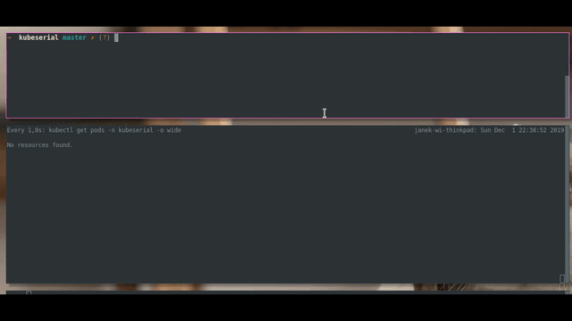

# KubeSerial

Manage your serial devices like 3D printers or CNC machines on your k8s cluster.

---

KubeSerial monitors your cluster nodes for physical devices specified in spec. Once the device is connected, it creates gateway service that exposes it over the network and manager service with specified management software. When the device gets disconnected everything is cleaned up.

### Example:

This is an example configuration for 2 popular cheap printers - Ender 3 and Anet A8 - that handles their management and exposes Octoprint instance for each of them at `http://ender3.my.home` and `http://aneta8.my.home`.

```yaml
# deployment/my-kubeserial.yaml
apiVersion: app.kubeserial.com/v1alpha1
kind: KubeSerial
metadata:
  name: kubeserial
  namespace: kubeserial
spec:
  devices:
    - name:       "ender3"
      idVendor:   "0403"
      idProduct:  "6001"
      manager:    "octoprint"
      subsystem:  "tty"
    - name:       "aneta8"
      idVendor:   "1a86"
      idProduct:  "7523"
      manager:    "octoprint"
      subsystem:  "tty"
  ingress:
    enabled: true
    domain: ".my.home"
    annotations:
      kubernetes.io/ingress.class: traefik
```




# Requirements

- k8s cluster - ATM only ARM clusters are supported.
- Ingress controller installed in the cluster for ingress rules to work.

# Install

### Install manually

Create the Deployment, CRDs, ServiceAccount etc.

```
kubectl create -f deploy/kubeserial.yaml
```

Create your configuration file based on example above. To find out values of `idVendor` and `idProduct` for your device, connect it to your computer, locate where it is (let's say `/dev/ttyUSB0`) and run:
```
udevadm info -q all -n /dev/ttyUSB0 --attribute-walk
```
Look for them from the top. Once you've got your configuration, run

```
kubectl create -f my-kubeserial.yaml
```

# Components

### Controller

Manages operator components by observing state of each of the devices.

### Monitor

Monitors cluster nodes waiting for specified serial devices to be connected and updates their state.

### Gateway

Exposed specific device in cluster network over TCP.

### Manager

Creates deployment with management software, mounts your device over the network and gives you access through ingress rule.

###### Supported managers

- Octoprint


# Build

## Multi-Arch Setup

If running from an x86 system, run the following to install necessary qemu emulation:

```sh
docker run --rm --privileged multiarch/qemu-user-static --reset -p yes
```

See <https://github.com/multiarch/qemu-user-static> for more details.

## To Compile Kubeserial Binary

```sh
make compile
```

## Build The Docker Comtainer

```sh
make build
```

