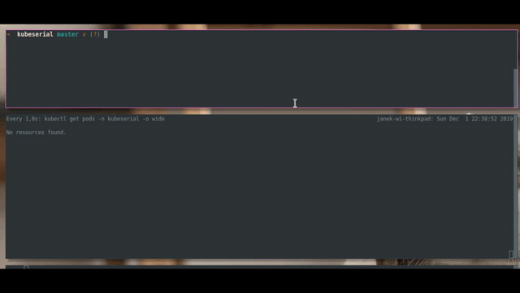

# KubeSerial

KubeSerial monitors your cluster nodes for physical devices specified in spec. Once the device is connected, it creates gateway service that exposes it over the network and manager service with specified management software. When the device gets disconnected everything is cleaned up.

## Quick start

You can find quick start guide [here](https://baraniewski.com/kubeserial/quick_start.html)

## Docs

Docs can be found [here](https://baraniewski.com/kubeserial/)
