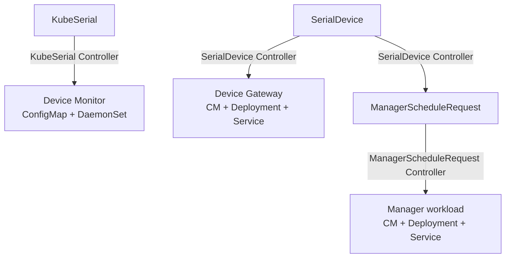

# Controllers

The controller manager (`cmd/manager`) runs the reconcile loops that drive the rest of the system. It watches the KubeSerial custom resources and creates or removes the Device Monitor, Device Gateways and Manager workloads to match the desired state.

<!-- toc -->

It is configured with a few flags (see `cmd/manager/main.go`):

| Flag | Default | Purpose |
| --- | --- | --- |
| `--namespace` | `kubeserial` | Namespace the controllers run in and create resources in |
| `--device-monitor-version` | `latest` | Tag of the `kubeserial-device-monitor` image to deploy |
| `--metrics-bind-address` | `:8080` | Metrics endpoint |
| `--health-probe-bind-address` | `:8081` | Health/readiness probe endpoint |
| `--leader-elect` | `false` | Enable leader election |

## Controller Loops

### KubeSerial Controller

Reconciles the [`KubeSerial`](../configuration/kubeserial.md) resource. From its `spec.serialDevices` list it builds the udev rules ConfigMap and the Device Monitor DaemonSet, then ensures both exist in the cluster. This is what turns your device list into a running monitor on every node.

### SerialDevice Controller

Reconciles each [`SerialDevice`](../configuration/devices.md). On every reconcile it:

1. ensures the `Available`, `Ready` and `Free` conditions exist (creating them as `False`/`NotValidated` if missing);
2. validates the device is ready - if the device references a manager, the referenced [`Manager`](../configuration/managers/internal.md) object must exist, otherwise `Ready` is set to `False` with reason `ManagerNotAvailable`;
3. if the device is `Available` (the monitor has detected it), it requests a [Device Gateway](gateway.md) and, when the device declares a manager, creates a `ManagerScheduleRequest`;
4. if the device is not `Available`, it tears the gateway down again and removes any `ManagerScheduleRequest`.

The gateway and the schedule request are owned by the SerialDevice, so they are garbage collected automatically.

### ManagerScheduleRequest Controller

Reconciles each `ManagerScheduleRequest` (created by the SerialDevice controller). It looks up the referenced `Manager`, then schedules the management workload for the device: a Deployment running the manager image, a Service, and a ConfigMap when the manager provides config. The deployment's command is wrapped with `socat` so the manager container sees the device as a local `/dev/device` bridged to the gateway. See [Manager scheduled by KubeSerial](../configuration/managers/internal.md).
