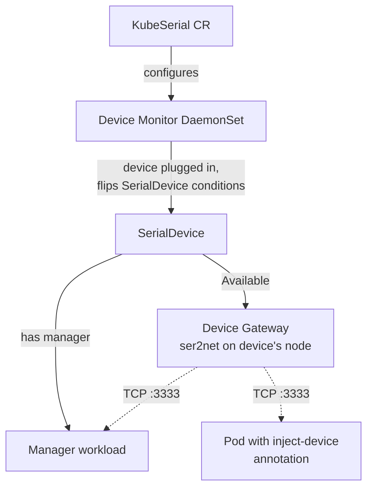

# KubeSerial

<b>Work with serial devices in Kubernetes</b>

---

KubeSerial is a set of Kubernetes controllers and a mutating webhook that make physical serial devices (3D printers, Zigbee/Z-Wave dongles, microcontrollers, anything that shows up under `/dev`) usable from any workload in your cluster. It decouples the node a device is physically plugged into from the workload that wants to talk to it: a pod scheduled anywhere in the cluster reaches the device over the network as if it were local.

## How it works

You describe your devices once (by USB `idVendor` / `idProduct`) in a [KubeSerial][KS] resource. From there KubeSerial takes care of detection, exposure and consumption:

1. The [Device Monitor][DM] runs as a DaemonSet on every node. It writes udev rules derived from your device list, then watches `/dev` for the matching symlinks. When a device appears or disappears it flips the conditions on the corresponding [SerialDevice][D] and records which node it is attached to.
2. Once a [SerialDevice][D] becomes `Available`, the controllers schedule a [Device Gateway][DG] onto that exact node. The gateway runs `ser2net` and exposes the device over TCP as a `ClusterIP` service (`<device>-gateway:3333`).
3. With the gateway in place the device can be consumed in one of two ways:
   - **A predefined [Manager][M]** scheduled automatically when the device connects (for example an OctoPrint instance for a 3D printer).
   - **The device-injection webhook**, which lets you attach the device to *any* pod by adding a single annotation, with no image changes. See [Manager scheduled externally][MEC].

In both cases the consuming container gets a local `/dev/device` PTY (created by `socat`) that is bridged to the gateway, so existing software keeps talking to a plain serial port.

## When to use it

KubeSerial is a good fit when:

- you have serial/USB devices attached to specific nodes but want to run the software that uses them anywhere in the cluster;
- you want devices to be discovered and exposed automatically as they are plugged in and unplugged;
- you want to give an arbitrary workload access to a device without rebuilding its image.

<!-- Links  -->
[KS]: configuration/kubeserial.md          "KubeSerial"
[D]:  configuration/devices.md             "Device"
[DM]: components/monitor.md                "Device Monitor"
[DG]: components/gateway.md                "Device Gateway"
[M]:  configuration/managers/SUMMARY.md    "Managers"
[MEC]: configuration/managers/external.md  "Manager external"
